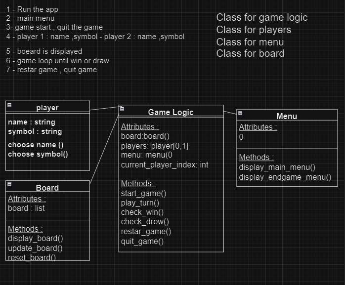

<h3>Python Object Oriented Programming | Build Tic Tac Toe</h3>

<h3> Description :</h3>

Hello and welcome to my "Tic-Tac-Toe" Project! This project is a Tic-Tac-Toe game.

<h3>How To Start ?</h3>

1 - Clone the project to your machine :

2 - Execute the <code>game.py</code> file and enjoy!

<h3 align="center">Bilal Aj</h3>
